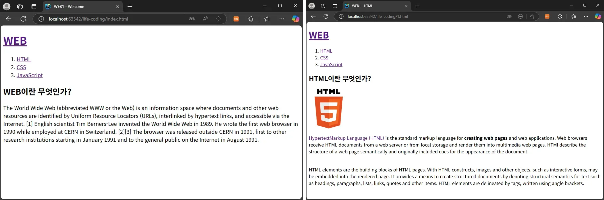

# Web Study

 

## Intro.
- HUST | Web 스터디
- '생활코딩' 강의 수강 후 정리

 

## 1. Content

| HTML                                        | CSS                                        | JavaScript                               | React | MySQL | Node.js |
|---------------------------------------------|--------------------------------------------|------------------------------------------| ----- | ----- | ------- |
|  |  |  |       |       |         |
| 웹 페이지의 뼈대를 구성하는 언어                          | 웹 페이지에 스타일을 부여하는 언어                        | 웹 페이지가 사용자와 상호작용할 수 있도록 만들어 주는 언어        |       |       |         |

 

## 2. 실습 결과

### 2-1. HTML 실습 결과

 

---

### 2-2. CSS 실습 결과

 

 

---

### 2-3. JavaScript 실습 결과

 

---

