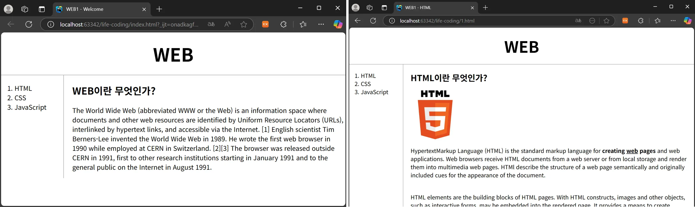

# Web Study

 

## Intro.
- **HUST** | Web 스터디
- '생활코딩' 강의 수강 후 정리

 

## 1. Content

| HTML                                        | CSS                                        | JavaScript                       | React | MySQL | Node.js |
|:-------------------------------------------:|:------------------------------------------:|:--------------------------------:| :---: | :---: | :-----: |
|  |  |  |  |  |  |
| 웹 페이지의 뼈대를 구성                          | 웹 페이지에 스타일을 부여                | 웹 페이지와 사용자의 상호작용을 지원 | 프런트엔드 프레임워크 | 데이터베이스 | 백엔드 프레임워크 |

 

## 2. 실습 결과

### 2-1. `HTML 실습 결과` | 웹 페이지 뼈대 구성

 

---

### 2-2. `CSS 실습 결과` | 스타일 부여, 반응형 디자인

 

 

---

### 2-3. `JavaScript 실습 결과` | 다크모드, 라이트모드

 

---

